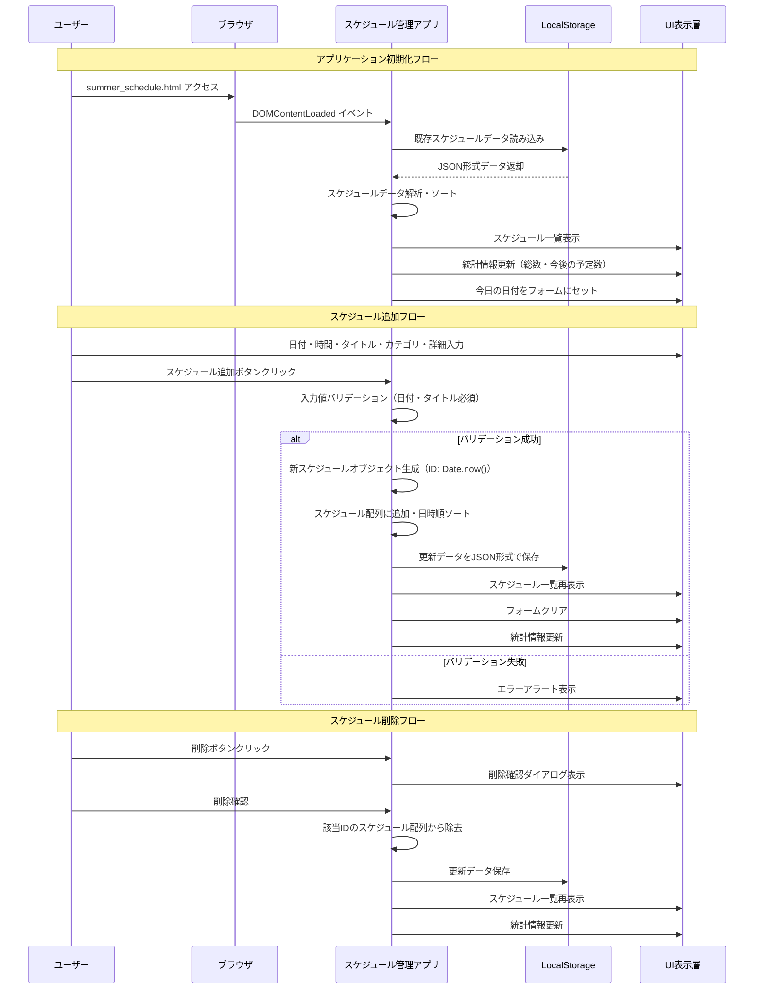
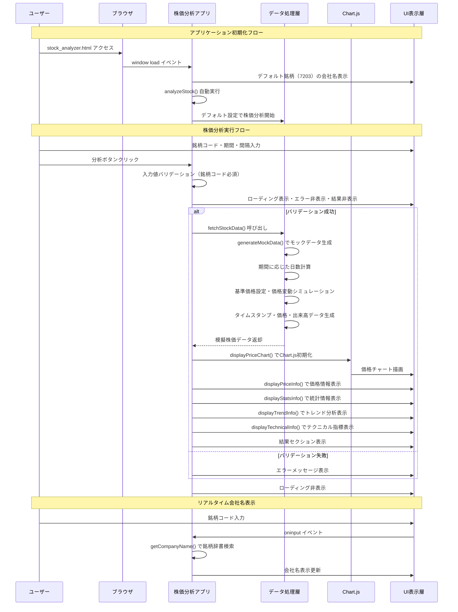
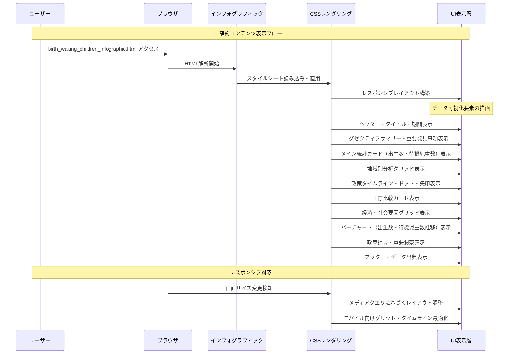
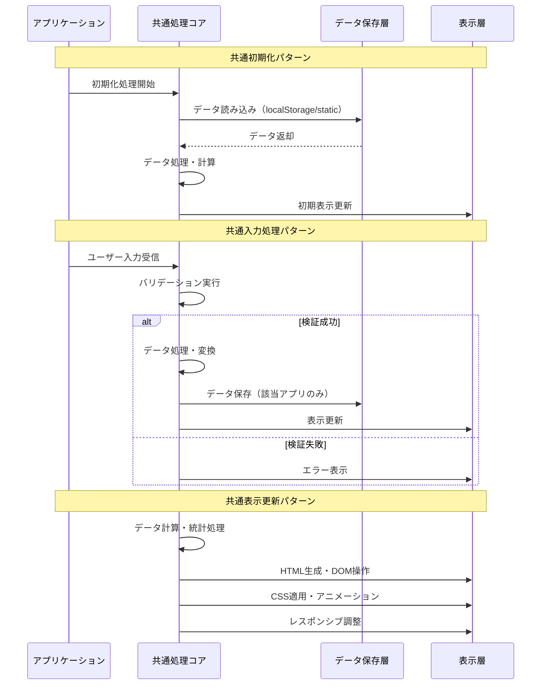

# Webアプリケーション処理シーケンス図

このファイルは、プロジェクトの3つのWebアプリケーションの処理フローをマーメイド記法で表現したシーケンス図です。

## 1. 夏休みスケジュール管理アプリ

## 2. 株価分析アプリ

## 3. 出生数・待機児童数インフォグラフィック

## 共通処理パターン分析

## アーキテクチャ特徴

### 設計パターン
- **単一ファイル構成**: HTML/CSS/JavaScript一体型
- **バニラJavaScript**: フレームワーク非依存
- **レスポンシブデザイン**: CSS Grid/Flexbox活用
- **日本語対応**: 専用フォントスタック使用

### データ管理
- **スケジュール管理**: localStorage永続化
- **株価分析**: メモリ内モックデータ
- **インフォグラフィック**: 静的データ埋め込み

### 処理フロー特徴
- **同期処理中心**: 軽量データのため非同期処理最小限
- **イベント駆動**: DOM操作とユーザーイベント連携
- **状態管理**: 単純なオブジェクト・配列ベース
- **エラーハンドリング**: バリデーション・try-catch活用

最終更新: 2024年12月10日